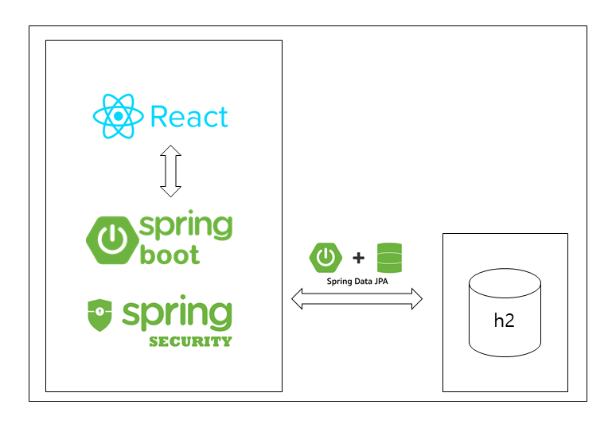
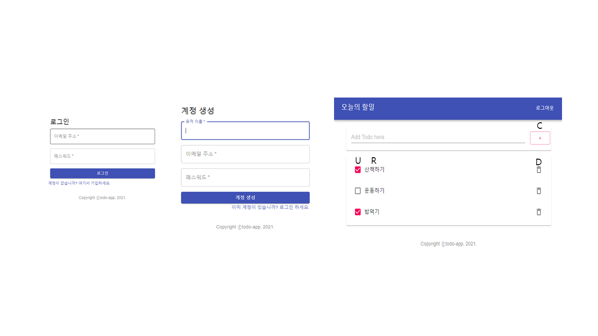

# to-do-list 구현 토이프로젝트

## 목표
웹 기반 Todo 애플리케이션 구축

## 사용기술 및 개발환경

1. 프론트엔드: ReactJS
2. 백엔드: Spring Boot, Spring Security, JPA, Lombok, Java8
3. 빌드: Gradle
4. DB: h2
5. 배포: 집에 남는 컴퓨터...(추후 AWS 일라스틱 빈스톡 더 공부해서 사용해볼 예정)
6. 도구: Eclipse, VS Code, Postman

## 새롭게 배웠던 것들
1. 스프링 부트와 Gradle을 처음 사용해 본 프로젝트로 특히 mvn repository를 이용한 dependency 설정의 간편함을 몸소 느꼈다. 
2. ORM 역시 처음 사용해 보았는데, 스프링 데이터 JPA을 통해 쿼리문을 생성하지 않아 빠른 구현이 가능하겠다는 생각이 들었다. 하지만 쿼리문을 만들어 매핑하는 MyBatis와 다르게 JPA의 동작방식에 대해 따로 공부하지 않으면 오히려 안정성이 떨어지고 데이터를 잘못 가공할 수도 있을 것이다. 실제 프로젝트에서 사용하게 된다면 철저한 공부가 필요할 것.
3. 기본적인 React의 흐름을 공부하였다. 컴포넌트, props, state, 이벤트 핸들러, react-route-dom을 사용해보았다. 
4. 크로스-오리진 리소스 셰어링(CORS) 문제와 이를 해결하는 것을 배웠다. 리액트는 3000번 포트를 사용하고 톰캣은 8080을 사용해서 발생하는 CORS문제를 자바 config를 사용하거나 리액트의 프록시 설정을 통해 해결했다.  
5. 인증과 인가의 방법으로 JWT(Json Web Token)을 사용했다. 세션처럼 서버에 값을 저장하는 것이 아닌, 전자서명을 비밀키(대칭키)로 디코딩해 비교하는 방식으로 서버에 부하를 줄일 수 있다. 토큰과 보안과 관련해서는 좀 더 깊게 공부할 필요가 있다.
6. 스프링 시큐리티 = 서블릿 필터의 집합. 스프링 시큐리티가 추가되면 FilterChainProxy(스프링이 관리하는 스프링 빈 필터) 필터를 서블릿 필터에 끼워넣어주는 방식을 이용한다. 
7. 로컬 스토리지를 이용한 엑세스 토큰 관리를 통해 프론트와 백의 통신이 가능하게 설정.  

## 화면
